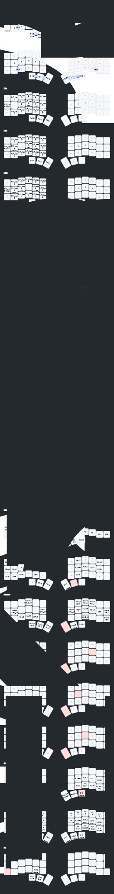

# Glorious Corne

sunaku's [Glorious Engrammer][ge] keymap (v52) ported to a **wireless 42-key Corne**
(nice!nano v2, ZMK), QWERTY base, macOS home row mods, no RGB.

[ge]: https://github.com/sunaku/glove80-keymaps

## Layout



The eight functional layers, rendered with
[keymap-drawer](https://github.com/caksoylar/keymap-drawer) and the styling in
[`keymap_drawer.config.yaml`](keymap_drawer.config.yaml): macOS `⌘⇧⌥⌃` glyphs,
softly-shaded hold/layer keys, faded pass-through keys. A framed view with a
legend lives in [`docs/keymap-layers.html`](docs/keymap-layers.html).

Regenerate after any keymap change:

```sh
keymap -c keymap_drawer.config.yaml parse -z config/corne.keymap -o keymap.yaml
keymap -c keymap_drawer.config.yaml draw keymap.yaml \
  -s BASE CURS NUM FUNC SYM MOUS SYS MAGIC -o img/keymap.svg
```

## What this is

The Glove80 keymap, minus what a Corne physically cannot hold. sunaku's QWERTY
build uses exactly three thumb keys per hand (`T1`/`T4`/`T5`) — which is exactly
what a Corne has — so all six thumb layers port 1:1:

| Thumb | Left | Right |
| --- | --- | --- |
| outer | `Esc` → Function | `Enter` → System |
| middle | `Bksp` → Cursor | `Space` → Symbol |
| inner | `Del` → Number | `Tab` → Mouse |

Magic is held from the outer pinky key below `=`.

**20 of ZMK's 32 layers.** The 8 home-row-mod layers are kept in full, but the
mods are relaxed to **non-bilateral** so same-hand shortcuts work (`Cmd+T`). Dropped: the three alternate alpha layouts, Gaming (Glove80 keywell
geometry), Emoji/World (reachable only from the lost R6), Factory, and the macOS
toggle layers — macOS is compiled in via `OPERATING_SYSTEM 'M'` instead.

## Geometry

> The *rehoming* rationale below is sunaku's original port; individual layer
> **contents have since been personalized** — see the layer map above for what
> each key actually does today.

The Glove80 has **six** rows; a Corne has three. Rows R3/R4/R5 map 1:1 onto the
alpha block. R1, R2 and R6 are lost. R2 costs nothing (the Number layer covers
every digit), R1 is nearly empty — but **R6 carried `(`, `)`, `@`, `&`, `[`, `]`,
Magic, and the right-hand same-hand mods**, so those are rehomed:

- `(` and `)` → Symbol layer, ring and middle fingers on the row above home
  (replacing Shift-Tab/Insert, which are redundant with the thumbs). `(` on ring
  preserves sunaku's inward roll.
- `&` and `@` → the equally redundant Del/Esc beside them.
- Right-hand same-hand mods → Symbol and System **home row**, which is better
  placed than the Glove80 manages.
- Hex `A`–`D` → Number layer's redundant Ret/Space/Tab/Bspc mirror block.
- Magic → outer pinky, row 3.

Of sunaku's 22 combos, 6 survive — with three thumbs there are only three pairs
per hand and all three are already used. The other 16 needed `T2`/`T3`/`T6`.

## No RGB

This board has no LEDs. `CONFIG_ZMK_RGB_UNDERGLOW=n` is what actually matters:
nothing then selects `LED_STRIP`, so `CONFIG_SPI` stays off and SPIM3 is never
initialized. The overlays additionally set `&spi3 { status = "disabled"; }` as
belt-and-braces, because ZMK's own Corne shield tree declares the bus and a
`ws2812` strip on it — that file is always applied, so it cannot be removed from
here, only overridden.

If LEDs are ever installed, restore `optional/corne_rgb_module` per `build.yaml`
and revert the overlays from git history.

## Credits

- **[sunaku/glove80-keymaps][ge]** — the Glorious Engrammer keymap this ports.
- **[erickueen/ergo-keyboards](https://github.com/erickueen/ergo-keyboards)** —
  the Corne ZMK foundation: bilateral HRM behaviors on Corne geometry, and the
  custom RGB module kept under `optional/`.

MIT, as with ZMK and both upstreams.
